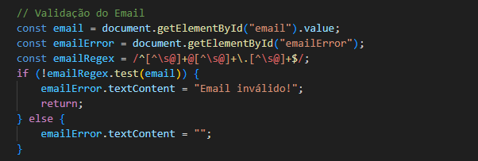
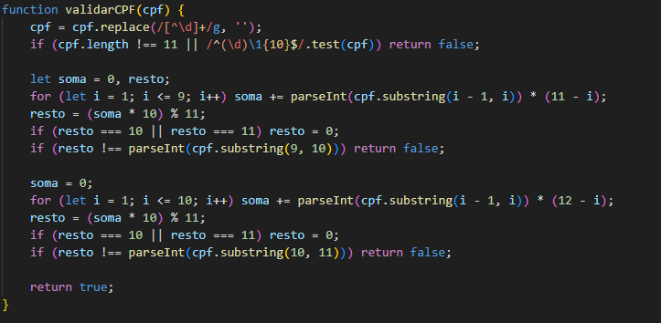
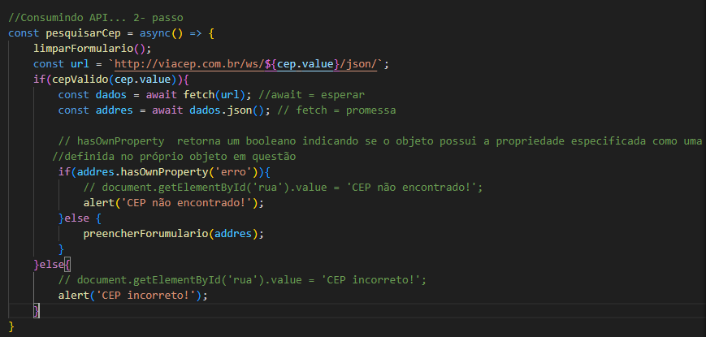

## CADASTRO PARA E-COMMERCE

Este projeto é um formulário de cadastro de usuários para uma plataforma de e-Commerce. Ele inclui validação de CPF, email, e consumo de uma API externa para buscar o endereço completo a partir do CEP (utilizando a API do ViaCEP). O projeto foi desenvolvido com HTML, CSS e JavaScript, visando oferecer uma interface funcional e intuitiva, com validações adequadas dos dados de entrada.

## Funcionalidades Principais
Validação de Email: Utiliza o tipo email do HTML para validar o formato de entrada do email.
Validação de CPF: Implementada com JavaScript, validando o número do CPF usando um algoritmo padrão.
Busca de Endereço por CEP: Quando o usuário insere um CEP válido, o sistema preenche automaticamente o campo de endereço, consumindo a API ViaCEP para obter os dados.
Interface Responsiva: O formulário é responsivo e tem um design básico para facilitar o uso.

Esse código em JavaScript está adicionando um **event listener** ao formulário com o ID `"cadastroForm"` que será ativado no momento em que o formulário for enviado (evento `"submit"`). A função anônima passada para o `addEventListener` faz duas coisas:

1. **Intercepta o envio do formulário:** Quando o formulário for enviado, a função é executada.
   
2. **`event.preventDefault()`**: Essa linha previne o comportamento padrão do formulário, que seria recarregar a página ou enviar os dados ao servidor imediatamente. Com isso, o envio do formulário é bloqueado, permitindo que o desenvolvedor adicione lógica adicional antes de processar os dados do formulário ou enviá-los por métodos alternativos, como uma requisição AJAX.

Esse código é útil quando se deseja controlar o envio do formulário e processar os dados de maneira customizada.


## validação do e-mail 

Esse trecho de código em JavaScript faz a validação de um campo de email em um formulário. Vamos detalhar cada parte:

1. **`const email = document.getElementById("email").value;`**: 
   - Aqui, o código obtém o valor inserido no campo de entrada com o ID `"email"`. O método `.value` extrai o valor atual desse campo.

2. **`const emailError = document.getElementById("emailError");`**: 
   - Essa linha busca um elemento HTML com o ID `"emailError"`. Provavelmente, esse elemento é onde as mensagens de erro relacionadas ao email são exibidas.

3. **`const emailRegex = /^[^\s@]+@[^\s@]+\.[^\s@]+$/;`**: 
   - Isso define uma **expressão regular (regex)** para validar o formato do email. A regex garante que:
     - O email não tenha espaços em branco ou caracteres inválidos antes do `@`.
     - Exista um domínio válido após o `@` e um sufixo (`.com`, `.org`, etc.).

4. **`if (!emailRegex.test(email)) {`**: 
   - Essa condição verifica se o valor inserido no campo de email não corresponde à regex. O método `.test()` retorna `true` se o email estiver no formato válido e `false` caso contrário.
   
5. **`emailError.textContent = "Email inválido!"; return;`**: 
   - Se o email for inválido, o código define o conteúdo do elemento `emailError` como `"Email inválido!"`, exibindo essa mensagem de erro. Em seguida, o `return` interrompe a execução da função, evitando que o restante do código seja executado.

6. **`else { emailError.textContent = ""; }`**: 
   - Se o email for válido, o conteúdo do `emailError` é esvaziado (removendo qualquer mensagem de erro anterior).



## validação do cpf 

Explicação Rápida da Função validarCPF:
1.	Limpeza do CPF: Remove quaisquer caracteres que não sejam dígitos.
2.	Verificação de Comprimento e Sequências Repetidas: Garante que o CPF tenha exatamente 11 dígitos e não seja uma sequência repetida (como "111.111.111-11").
3.	Cálculo dos Dígitos Verificadores: Calcula os dois últimos dígitos do CPF para verificar se correspondem aos fornecidos.
4.	Retorno: Retorna true se o CPF for válido ou false caso contrário.

## verificação cpf

A função `validarCPF(cpf)` tem o objetivo de validar um número de CPF brasileiro com base nos dois dígitos verificadores, garantindo que o número segue a estrutura correta. Vamos analisar o código em detalhes:

### Explicação Detalhada:

1. **Remoção de Caracteres Não Numéricos:**
   ```javascript
   cpf = cpf.replace(/[^\d]+/g, '');
   ```
   - Aqui, o código utiliza uma expressão regular para remover todos os caracteres que não sejam dígitos, como pontos (`.`), traços (`-`), ou espaços. Isso deixa apenas os números no CPF.

2. **Verificação de Comprimento e Sequências Repetidas:**
   ```javascript
   if (cpf.length !== 11 || /^(\d)\1{10}$/.test(cpf)) return false;
   ```
   - **`cpf.length !== 11`:** Verifica se o CPF tem exatamente 11 dígitos. Se não tiver, retorna `false` imediatamente.
   - **`/^(\d)\1{10}$/.test(cpf)`:** Essa expressão regular verifica se todos os dígitos são iguais (exemplo: "111.111.111-11"). Se for o caso, também retorna `false`, pois um CPF com todos os dígitos iguais é inválido.

3. **Cálculo do Primeiro Dígito Verificador:**  
   
   - **Cálculo da Soma:** Um laço `for` percorre os primeiros 9 dígitos do CPF, multiplicando cada dígito por um peso que começa em 10 e vai diminuindo até 2.
   - **Resto:** Após o cálculo da soma, o código calcula o **resto** da divisão da soma multiplicada por 10 por 11.
   - **Ajuste do Resto:** Se o resto for 10 ou 11, ele é ajustado para 0 (segundo as regras da validação do CPF).
   - **Comparação com o 10º Dígito:** O resto é comparado com o primeiro dígito verificador (o 10º dígito do CPF). Se não for igual, o CPF é inválido e a função retorna `false`.

4. **Cálculo do Segundo Dígito Verificador:**
   
   - **Cálculo da Soma:** Um segundo laço `for` percorre os primeiros 10 dígitos do CPF, multiplicando cada um por pesos que começam em 11 e vão diminuindo até 2.
   - **Resto:** O resto é novamente calculado da mesma forma que no primeiro dígito verificador.
   - **Comparação com o 11º Dígito:** O resultado é comparado com o segundo dígito verificador (o 11º dígito do CPF). Se não for igual, o CPF é inválido e a função retorna `false`.

5. **Retorno Final:**
   ```javascript
   return true;
   ```
   - Se os dois dígitos verificadores estiverem corretos, a função retorna `true`, indicando que o CPF é válido.

### Resumo do Funcionamento

1. O CPF é limpo, removendo qualquer caractere não numérico.
2. O código verifica se o CPF tem 11 dígitos e não é uma sequência repetida.
3. Calcula-se o primeiro dígito verificador com base nos primeiros 9 dígitos.
4. Se o primeiro dígito verificador estiver correto, o segundo dígito é calculado com base nos primeiros 10 dígitos.
5. Se ambos os dígitos verificadores forem válidos, a função retorna `true`; caso contrário, `false`.

### Regras da Validação do CPF:

- O CPF é composto por 9 dígitos iniciais e 2 dígitos verificadores.
- O primeiro dígito verificador é calculado a partir dos 9 primeiros dígitos.
- O segundo dígito verificador é calculado a partir dos 9 dígitos mais o primeiro dígito verificador.
  
Esses dígitos verificadores são obtidos através de cálculos matemáticos específicos, como mostrado no código, e servem para garantir que o CPF segue uma estrutura válida.

Esse trecho de código em JavaScript define uma função chamada limparFormulario, que é usada para limpar os campos de um formulário relacionados ao endereço, a partir do campo de CEP. Ele é útil em situações como, por exemplo, quando um CEP inválido é inserido, ou o usuário quer redefinir o formulário.
Detalhamento:
1.	Função limparFormulario:
•	A função é declarada como uma função arrow (=>), o que é uma sintaxe mais moderna de função em JavaScript.j
•	A função não recebe nenhum argumento, e seu objetivo é apenas limpar (definir como vazio) os campos de endereço no formulário.
2.	Campos Limpos:
•	Os campos do formulário, identificados pelos IDs (rua, bairro, cidade, estado), são todos acessados com document.getElementById().
•	O valor de cada campo é redefinido para uma string vazia (''), removendo o conteúdo previamente preenchido.
3.	Os campos que são limpos:  
•	Rua (rua): Campo de entrada do nome da rua.  
•	Bairro (bairro): Campo de entrada do bairro.  
•	Cidade (cidade): Campo de entrada da cidade.  
•	Estado (estado): Campo de entrada do estado.  

 Esse trecho de código JavaScript consome a API pública do ViaCep para pesquisar um endereço com base em um número de CEP fornecido. Ele utiliza a função assíncrona pesquisarCep para lidar com a requisição e resposta da API, além de validar o CEP e preencher o formulário com os dados recebidos. Vamos detalhar o que acontece em cada parte do código:
Explicação do Código
1. Função Assíncrona pesquisarCep:  
• Esta função é declarada como assíncrona (async), permitindo o uso de await para trabalhar com operações assíncronas, como chamadas de API. Isso significa que o código vai esperar a conclusão de certas operações antes de continuar.
2. Limpar o Formulário:  
• Antes de fazer qualquer pesquisa, o formulário é limpo usando a função limparFormulario(), que limpa os campos de endereço, garantindo que o formulário não tenha dados antigos quando o usuário busca um novo CEP.
3. Criação da URL para a API ViaCep:
javascript
Copiar código
const url = `http://viacep.com.br/ws/${cep.value}/json/`;
• Aqui, a URL é montada dinamicamente com o valor do CEP inserido pelo usuário (cep.value).
• Exemplo de URL gerada: http://viacep.com.br/ws/01001000/json/ (onde "01001000" é o CEP).
4. Validação do CEP:  
if(cepValido(cep.value)){
• A função cepValido(cep.value) é chamada para verificar se o CEP inserido pelo usuário está em um formato válido (geralmente, um CEP tem 8 dígitos). Se o CEP for válido, a busca pela API prossegue, caso contrário, exibe uma mensagem de erro.  
5. Busca de Dados da API:  
• await fetch(url): Faz uma requisição HTTP para a API ViaCep utilizando fetch, que é uma função nativa do JavaScript para buscar dados. O await faz o código esperar pela resposta.
• await dados.json(): Após receber a resposta da API, o método .json() transforma os dados recebidos em formato JSON, e o await espera até que esses dados sejam completamente processados.
• addres: Será o objeto JSON que contém os dados do endereço associado ao CEP.
6. Verificação de Erro no CEP:
javascript  
• addres.hasOwnProperty('erro'): Essa linha verifica se o objeto retornado pela API contém a propriedade 'erro'. Quando o CEP pesquisado não existe, a API ViaCep retorna um objeto JSON com a propriedade "erro": true. Nesse caso, a função exibe um alerta informando que o "CEP não foi encontrado".
7. Preenchimento do Formulário:
javascript
• Se o CEP for válido e encontrado, a função preencherForumulario(addres) é chamada, que usa os dados retornados pela API (rua, bairro, cidade, estado) para preencher os campos correspondentes no formulário.
8. Mensagem de CEP Inválido:
javascript
• Se o CEP não for válido de acordo com a função cepValido(), o sistema exibe um alerta indicando que o "CEP incorreto!" foi inserido.

